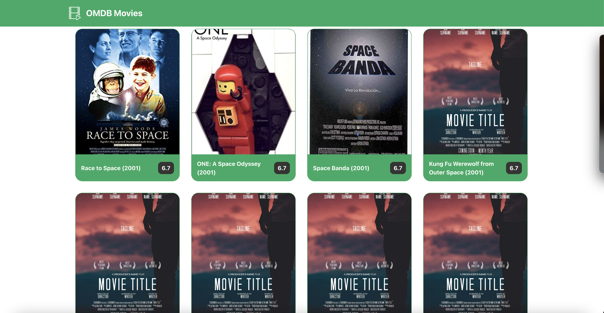
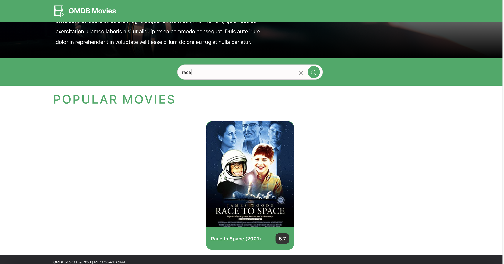
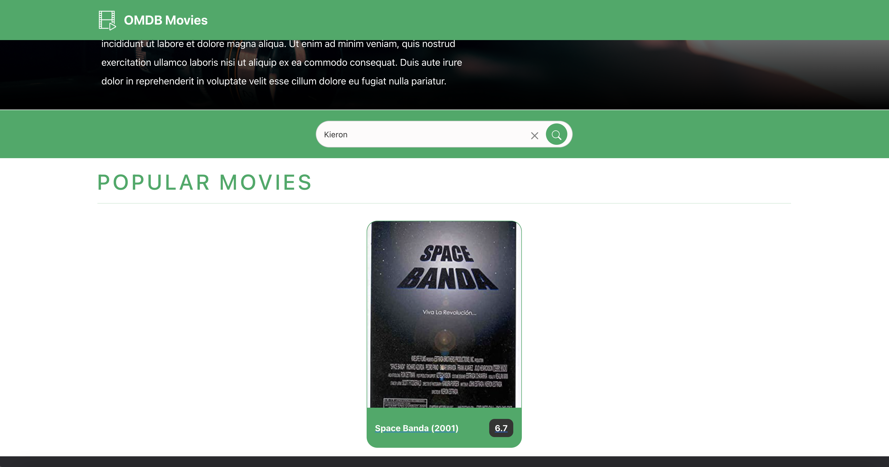

# OMDB Movies App
<hr />

- [Goal](#goal)
- [User Stories](#user-stories)
- [Scenario](#scenario)
- [Public API](#public-api)
- [FAQ](#faq)
- [Prerequisites](#prerequisites)
- [Application Setup](#application-setup)
- [Architecture Design](#architecture-design)
- [Approaches](#approaches)
- [Screenshots](#screenshots)

<a name="#goal"></a>

## Goal
<hr />

The movie application module developed to render the details of the movie and search movie by title, director, and plot.

Solution containing:

- implemented user stories [user stories](#user-stories)
- work accordingly to provided scenarios [scenarios](#scenario)
- followed and extended patterns provided in the task
- created some tests such as unit and e2e

<a name="#user-stories"></a>

## User Stories
<hr />

Build a system that pulls data from the movies API (omdbapi.com), stores that data in your system’s local database, and makes it searchable.

- Use NodeJS to build the backend
- Limit the data you pull to movies from the year 2001 that contain the word “space” in their title
- Use a database of your choice as the primary data store
- Create the search-backend using a search engine (e.g. ElasticSearch)
- Use React to build the frontend
- Provide a search functionality to the user
  - Search term can appear in title, director or plot of the movie
  - Movie-results should be shown with poster, title, director and plot
- Add sufficient test coverage to your system

<a name="#scenario"></a>

## Scenario
<hr />

1. Open `localhost:3000` for frontend
2. Open `localhost:5000` for server
3. App loads all movies containing the name `space` and only of year 2001
4. List of movies can be searched through title, director, and plot
5. Click an item on the list
6. Detailed overview of the movie can be seen that contains `genre`, `rating`, `actors`, `writer`, and `votes` etc
7. Navigate back to return to the list

<a name="#public-api"></a>

## Public API
<hr />

### Get list of movies with a year and title published by OMDBapi.com

The below endpoint will return all records containing the space as search term and type movies. As per omdbapi documentation the endpoint only returns 10 records per call. Therefore, needed to pass page number as well in order to retrieve more then 10 records.
To fetch data by using below `GET` endpoint, you need to change the `api_key`

`GET https://www.omdbapi.com/?apikey=<api_key>&s=space&type=movie&y=2001&page=1`

Demo: https://omdbapi.com/

### Get movie detail from OMDBapi.com

This endpoint will return the detailed information of one movie record, and the parameter `i` belongs to valid imdbID

`GET https://www.omdbapi.com/?apikey=<api_key>&i=ttt0123455`

<a name="#faq"></a>

## FAQ
<hr />

### Which technologies I used for client-side application?

The frontend application is developed on the below technologies, such as:

- React JS
- Redux (RxJS)
- Context API (for search field)
- Redux logger (debugging)
- Axios for http connection
- Testing: Jest (unit), and Cypress (e2e)

### Which technologies I used for server-side application?

The backend server is developed on the below technologies, such as:

- Node JS
- MongoDB (primary database)
- Mongoose (DB schema)
- Mongoosastic (elasticsearch)
- Reporting (nyc_output)
- PM2 (monitoring)
- Testing (Chai, Mocha, and Sinon)

### How did I design the application

The application is being designed by going through some reference sites e.g. http://phobic-heat.surge.sh/ and developed the application with respect to cover all provided user stories.

### Does develop solution a full-blown client and server?

Yes, basic and advanced routing exists, and also search engine is being created along with a primary database.

<a name="#prerequisites"></a>

## Prerequisites
<hr />

To run the application locally, you must have:

- Node: install [NODE](https://nodejs.org/en/download/)
- NPM/YARN should also be installed on your local system
- need to install [MongoDB Compass](https://www.mongodb.com/try/download/community) or connect through [MongoDB Atlas](https://www.mongodb.com/cloud/atlas) (free tier), but the app is being developed and tested on local database
- install [ElasticSearch](https://www.elastic.co/downloads/elasticsearch) locally

_**NOTE**: Currently docker is not being properly setup in this project that's why need to install all dependencies locally but docker-compose, Dockerfile and entrypoint.sh files are already created_

### Repository Cloning
Once you have installed all the dependencies on your local machine, you can start cloning the repository by using HTTPS or SSH

```
git clone https://github.com/Adeel91/omdb-movies.git
cd omdb-movies
```

### Environment files (Server Directory)
Please consider replacing the API_KEY with yours inside the .env file at project `server` directory

`OMDB_API_KEY=<YOUR OMDB API KEY>`

this api key is being used to fetch movies

<a name="#application-setup"></a>

## Application Setup
<hr />

This section tells you how to setup frontend and backend applications, but at this stage, the assumption is that all prerequisites are installed and running. Below the frontend and backend setup is explained separately.

### FRONTEND

In the project client directory, you can run the below commands to run, build and test the application.

### `yarn install`
Firstly, please install the dependencies with
`npm install #or yarn install`

### `yarn start`

In order to run the app locally (in the development mode), you can just type `yarn start` in the terminal and press Enter, and the command will open the application automatically in your default browser.

The app will open in the browser at http://localhost:3000.

### `yarn jest`

To run jest unit tests, just type `yarn jest` and enter. Currently, there are not enough unit tests.

### `yarn cypress:ci`

To run cypress e2e tests, just type `yarn cypress:ci` and enter.

### BACKEND

In the project server directory, you should run the below commands to run, build and test the application.

### `yarn install`
Install the dependencies with
`npm install #or yarn install`

### `yarn start`

In order to run the app locally (in the development mode), you can just type `yarn start` in the terminal and press Enter, and the command will open the application.

The app will be served at http://localhost:5000, because the port is already set in `.env` file.

If you change the port then consider changing the port in client app too `omdb-movies/client/src/store/epics/constants.js`

### `yarn build`

To run the application in background and monitor by using `pm2`

### `yarn logs`

This command will let you see the logs of `pm2`

### `yarn test`

The command will set `NODE_ENV` to test and execute all tests inside the tests folder and also generate a `nyc_output` report

### ELASTICSEARCH

Assuming, the elasticsearch is already installed so before browsing the application, run the elasticsearch by double clicking the batch file.

Go into the directory where you installed/downloaded elasticsearch. In my case, I had it here

`/Downloads/elasticsearch-7.13.4/`

Now open this directory by just typing `cd /Downloads/elasticsearch-7.13.4/bin`

Now you'll see the elasticsearch batch file and you should open it, and the full path should look like this:

`/Downloads/elasticsearch-7.13.4/bin/elasticsearch`

In the browser, check if elasticsearch is uup and running

`http://localhost:9200`


### ~~DOCKER SETUP~~

~~Run below docker command inside the server directory to install all the
dependencies such as mongodb, elasticsearch and backend server (nodejs)~~

```
docker-compose up -d
docker-compose up --build
```

___Note: Docker setup is not integrated properly___


<a name="#architecture-design"></a>

## Architecture Design
<hr />

Following points describes the architecture of the design:

- the connection with OMDDBapi.com is established from server
- the primary database can only be accessible from the server for CRUD operations.
- the indexing of content is also on the server level
- indexing happens only on saving the records in mongodb (database)
- if index in elasticsearch exist then storing into the database doesn't happen
- while retrieving the records, firstly check if index exist then return it from elasticseearch else retrieve and return the data from the database
- omdb only returns 10 records per each request, so added a loop on records and send requests multiple times tto fetch all records based on the search criteria
- after loading the server and client, if we run the client app on browser, client sends a request to REST API (to our server), and the server checks for elasticsearch indices and records in the database if they don't exist then our server requests OMDB and populate data in DB and elastic search
- server also validates the parameters of the REST API 
- currently, CORS are enabled for all requests but when deploying the app the CORS should only allow our client app
- when searching for title, director or plot from client-side app, the elasticsearch efficiently checks for the column/field to retrieve data
- client-side app requests to our REST api such as get movies, get movie detail, and search movies

<a name="#approaches"></a>

## Approaches
<hr />

The approach I also thought about was to fetch movies from OMDBapi directly from client and then save them into the database and index them in elasticsearch. The problem that I saw in that was insecure connection.

If having existing database records, then also tried to synchronize them in the elasticseearch but later, removed the synchronization because it was not neccessary for this sample project 

<a name="#screenshots"></a>

## Screenshots
<hr />

The screenshots of the application are as follows:

### Desktop

<table>
  <tr>
    <td>  </td>
    <td>  </td>
  </tr>
  <tr>
    <td>  </td>
    <td>  </td>
  </tr>
  <tr>
    <td>  </td>
    <td>  </td>
  </tr>
</table>
